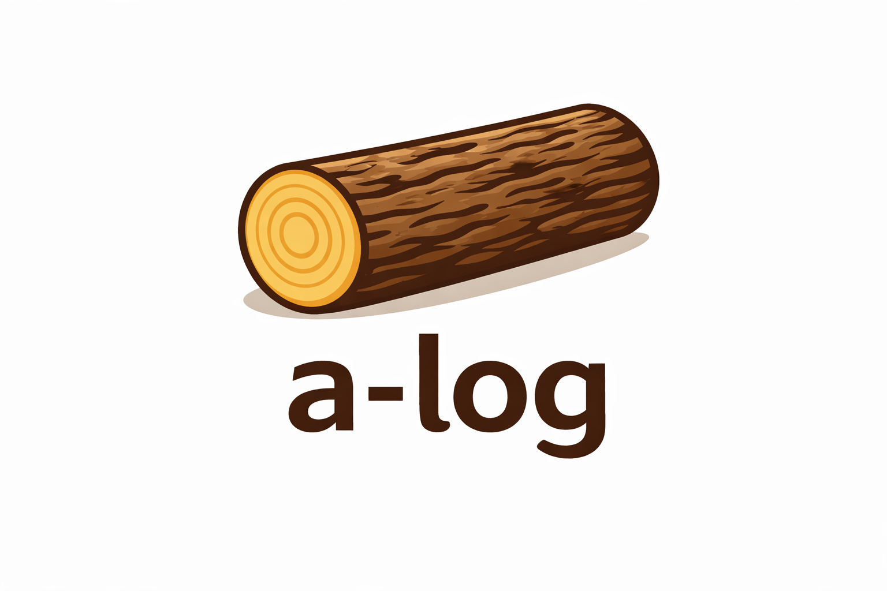

<!--
Copyright © 2012-2023 alog contributors
Copyright © 2025 a-log contributors
License: https://www.gnu.org/licenses/gpl-3.0.html
-->

<p align="center">
  
</p>

# a-log

**a-log** (agent log) is a command-line journal built for AI agents. It is a fork of [jrnl](https://github.com/jrnl-org/jrnl), extended with semantic search and designed to give agents a persistent, searchable memory.

## Features

- **Semantic search** — find entries by meaning, not just keywords
- Plain-text, human-readable journal files
- Timestamp-aware entry parsing
- AES encryption support
- External editor integration

## Quick Start

Create a new entry:

```sh
alog yesterday: Refactored the authentication module. Moved token validation into middleware.
```

Search by meaning:

```sh
alog --semantic "auth changes"
```

Everything before the first sentence-ending punctuation (`.`, `?`, `!`) is the title; the rest is the body. In your journal file, the result looks like:

    [2025-06-15 09:00] Refactored the authentication module.
    Moved token validation into middleware.

If you just call `alog` with no arguments, you will be prompted to compose your entry.

## Origin

a-log is a fork of [jrnl](https://jrnl.sh) by Jonathan Wren, Micah Ellison, and [many contributors](https://github.com/jrnl-org/jrnl/graphs/contributors). It retains full compatibility with jrnl's journal format while adding agent-oriented capabilities like semantic indexing and search.
